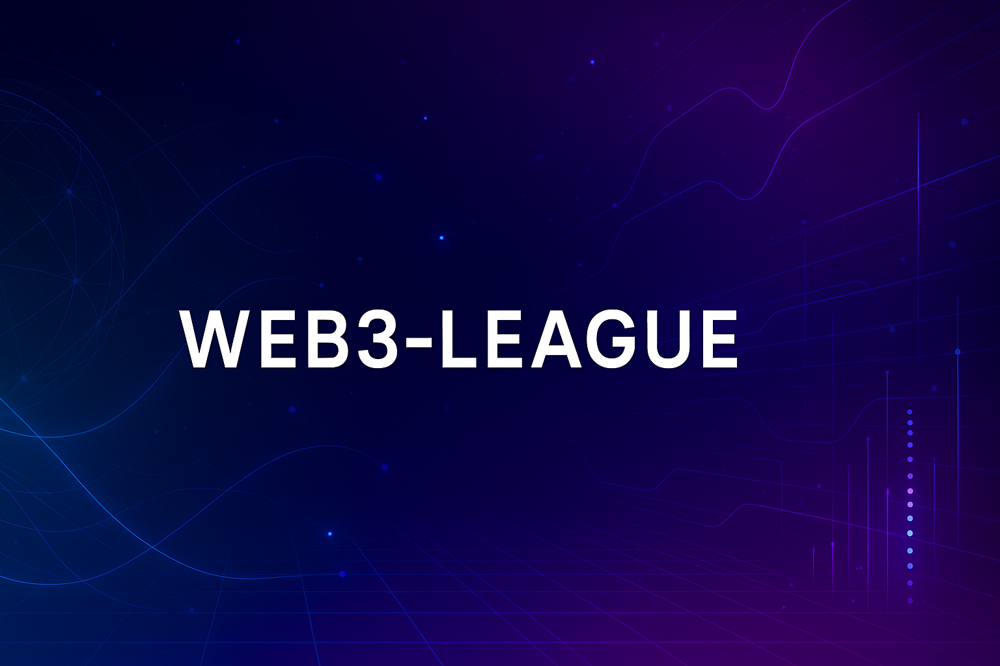

<!-- Banner -->

  

<!-- Title & Intro -->

  <b>Welcome to WEB3-LEAGUE</b> 
  Full-Stack Engineer • Open-Source Builder • Web3 & AI Enthusiast

<!-- Badges -->

  
  

---

## 👋 About Me

Hi, I’m the creator behind **WEB3-LEAGUE** 👨‍💻  
I’m a **full-stack developer** passionate about **web development, AI, and open-source innovation**.  
My goal is to build projects that are **accessible, scalable, and useful for the community**.  

- 💼 **Current Role**: Full-Stack Engineer  
- 💬 **Interests**: Web3, AI, Open-Source, Scalable Systems  
- 🌱 **Currently exploring**: Next-gen APIs & decentralized technologies  

---

## 🌟 My Work

I maintain <b>📂 {{NOMBRE_DE_REPOS}}+ public repositories</b> 
covering Web3, AI, APIs, and open-source projects.

  

---

## 📊 GitHub Stats

  
  

---

## 📫 Contact

🌍 <a href="https://github.com/Web3-League">GitHub</a> •  
✉️ Open to collaborations & discussions

---

✨ <b>Thanks for visiting my profile!</b> ✨

